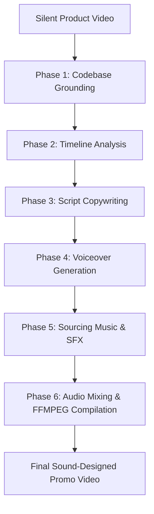

# Product Video Sound Design & Narration Automation Skill

This document provides step-by-step instructions for taking any raw, silent product animation video and producing a professional, fully voiced, and sound-designed promotional product video.

---

## Workflow Overview



---

## Phase 1: Codebase Grounding

Before writing the script, the agent must inspect the product repository to ensure all claims and product names are 100% accurate.

1. **Read Architectural Documentation**: Check files like `AGENTS.md`, `README.md`, or database schema files (`models.py`) to extract:
   - The exact product name (e.g., `TruthLayer`).
   - The core user categories (e.g., `business`, `creator`, `verifier`).
   - Key value propositions (e.g., "automating video compliance, RAG verification against brand guidelines").
2. **Scan the UI Codebase**: Search frontend directories (`frontend/app/` or `frontend/components/`) to identify visual terms, menus, and dashboard views that will appear in the video.

---

## Phase 2: Video Timeline Analysis

Analyze the silent video to define a strict timeline of visual scene changes and user interactions.

1. **Calculate Screen Durations**: Use `ffprobe` to determine the video length and visually map out timestamps:
   - **Hook/Problem Scene**: Start of video to first visual transition.
   - **Value Proposition Intro**: Product logo / introduction screen.
   - **Feature Walkthroughs**: Note when specific features (e.g., URL input, checkmarks, warning cards) load on screen.
   - **Call-to-Action (CTA) / Outro**: The final screen.
2. **Define Timing Constraints Table**: Write down a precise table of maximum allowed durations for each voiceover segment (with a 0.2-second padding) to avoid audio overlapping or spilling into subsequent scenes.

---

## Phase 3: Script Copywriting

Write a narrator script divided into sections matching the timeline constraints.

### Copywriting Rules:
- **Ground in Codebase**: Mirror the core terminology found in Phase 1 (e.g., use "lenses", "claims", "citations").
- **Strict Word-Count Management**: Standard speaking pace is roughly **130 to 150 words per minute** (~2.2 words per second). Use this formula to cap sentence length:
  $$\text{Max Words} = \text{Segment Duration (seconds)} \times 2.2$$
  *Keeping word count under this limit ensures the voice track runs at `1.0x` speed with zero artificial time compression, preserving natural human pauses.*
- **Tone**: Professional, clear, modern, and engaging (standard SaaS marketing tone).

---

## Phase 4: Voiceover Generation (ElevenLabs)

Generate speech files from the script using the ElevenLabs Text-to-Speech API.

### 1. API Call Parameters
- **Endpoint**: `POST https://api.elevenlabs.io/v1/text-to-speech/{voice_id}`
- **Headers**:
  - `xi-api-key`: `[YOUR_ELEVENLABS_API_KEY]`
  - `Content-Type`: `application/json`
  - `Accept`: `audio/mpeg`
- **Request Body**:
  ```json
  {
    "text": "Your script segment here...",
    "model_id": "eleven_multilingual_v2",
    "voice_settings": {
      "stability": 0.50,
      "similarity_boost": 0.75,
      "style": 0.0
    }
  }
  ```

### 2. Time-Stretching & Conversion
If a generated speech segment exceeds its scene duration limit, use FFMPEG's `atempo` filter to speed it up just enough to fit.
- **Formula**: $\text{Speed Factor} = \frac{\text{Raw Audio Duration}}{\text{Max Scene Duration}}$
- **FFMPEG Command**:
  ```bash
  ffmpeg -i segment.mp3 -filter:a "atempo=[speed_factor]" -ar 44100 segment_stretched.wav
  ```
  *(Keep the speed factor under **1.15x** for the narrator to maintain a natural pace. If it exceeds 1.15x, shorten the text instead).*

### 3. Credit Optimization Strategy (IMPORTANT)
To avoid consuming unnecessary ElevenLabs character credits during audio/music iterations:
1. Generate the individual speech files once and mix them into a single, combined voice track:
   ```bash
   ffmpeg -i sec1.wav -i sec2.wav ... -filter_complex "[0:a]adelay=[ms]:all=1[a1]; [1:a]adelay=[ms]:all=1[a2]; ... [a1][a2]amix=inputs=N:normalize=0[vo]" -map "[vo]" clean_voiceover.wav
   ```
2. **Save `clean_voiceover.wav` permanently** in your repository.
3. For all future iterations (changing background music, adjusting SFX volumes), read `clean_voiceover.wav` locally instead of calling the ElevenLabs API again.

---

## Phase 5: Sourcing Music & SFX

Download royalty-free assets directly from open-source repositories or Creative Commons hosts:

### 1. Background Music
- **Source**: Sourced from raw GitHub files (e.g., `mluedke2/app-preview-music`).
- **Styles**:
  - *Smooth / Ambient*: Ideal for premium, clean SaaS walkthroughs (e.g., `chill_preview_1.mp3`).
  - *Upbeat / Tech-Pop*: Ideal for fast, punchy app-previews (e.g., `Action_Preview_1.mp3`).
  - *Moody Hip-Hop / R&B*: Filtered beats (e.g., `dark_preview_2.mp3`) for a late-night, modern vibe.

### 2. UI Sound Effects
- **Source**: Sourced from raw CC0 assets (e.g., `Calinou/kenney-ui-audio` repository).
- **SFX Assets**:
  - `click1.wav`: Typing and mouse interactions.
  - `switch1.wav`: Checkboxes ticking or success indicators popping up.
  - `switch3.wav`: Critical warnings or contradiction alerts appearing.

---

## Phase 6: Audio Mixing & FFMPEG Compilation

Perform the final mix using FFMPEG's filtergraph:

### 1. Music Looping & Ducking
- **Looping**: Compute the music duration ($D_{\text{music}}$) and loop it to cover the video length ($D_{\text{video}}$) using the input flag `-stream_loop`:
  $$\text{Loops} = \lceil D_{\text{video}} / D_{\text{music}} \rceil - 1$$
- **Ducking**: Set background music volume between **`0.10` and `0.16`** (for instrumentals) or **`0.06` and `0.08`** (for vocal tracks) to keep the voiceover clear.
- **Fades**: Apply a 2-second fade-in at the start and a 3-second fade-out at the end.
  `[1:a]volume=0.16,afade=t=in:ss=0:d=2,afade=t=out:st=57:d=3[bg]`

### 2. SFX Delay Mapping
For each sound effect, use FFMPEG's `asplit` and `adelay` to duplicate the sound and place it at precise timestamps:
```
[sfx_input]volume=0.5,asplit=2[s1][s2];
[s1]adelay=17000:all=1[sd1];
[s2]adelay=18500:all=1[sd2];
```

### 3. Final Multi-Track Mix Command
Mix the voiceover track, the looped music, and all delayed SFX streams together:
```bash
ffmpeg -y \
  -i product_video.mp4 \
  -stream_loop [loops] -i bg_music.mp3 \
  -i clean_voiceover.wav \
  -i click_sfx.wav \
  -i pop_sfx.wav \
  -i alert_sfx.wav \
  -filter_complex "[2:a]volume=0.85[vo]; [1:a]volume=0.16,afade=t=in:ss=0:d=2,afade=t=out:st=57:d=3[bg]; [3:a]volume=0.6,asplit=2[c1][c2]; [c1]adelay=17000:all=1[cd1]; [c2]adelay=18500:all=1[cd2]; [vo][bg][cd1][cd2]amix=inputs=4:normalize=0[amix_out]" \
  -map 0:v \
  -map "[amix_out]" \
  -shortest \
  -c:v copy \
  -c:a aac \
  -b:a 192k \
  output_video_with_audio.mp4
```
*Note: `-c:v copy` ensures the video track is multiplexed losslessly without re-encoding, finishing the process instantly.*
